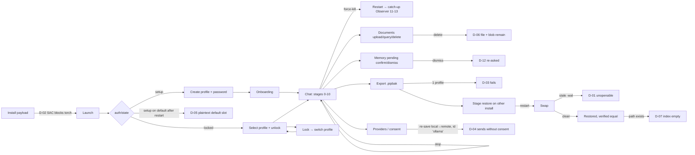

# Reliability validation — 2026-10-01

Evidence-first validation pass over the implemented product, run under the
reliability freeze: **no production code was changed.** Every finding below is
a report and a recommendation; fixing any of it needs a separate owner
authorization (FREEZE_LIST §2.4). Summary and status live in
`docs/FREEZE_LIST.md` §7.16; this file is the full record.

## 1. Executive summary

PIP's security boundaries mostly hold when measured from outside. All 64
REST method+path pairs refuse bad credentials, every gated route refuses
while locked, the WebSocket checks its token and origin, profiles stay
isolated, and a force-kill mid-conversation loses nothing. Consent holds for
every ordinary case tried.

The serious problems are in **data portability and deployment**, not in the
governance core:

| ID | Severity | One line |
|---|---|---|
| D-01 | **Critical** | An in-app restore installed over a profile with a leftover `-wal` produces a profile that opens with neither the new nor the old password |
| D-02 | **High** | On Windows with Smart App Control enforcing, the backend cannot start at all (unsigned torch DLL, imported eagerly) — confirmed on the staged installer payload |
| D-03 | **High** | The Backup screen's Export fails for an installation with exactly one profile — the common case |
| D-04 | **High (latent)** | Consent fails open for an endpoint re-saved from local to remote, or registered under the id `ollama`: the full prompt is sent with no consent |
| D-05 | Medium | After any restart, until a profile is chosen, the backend serves the unencrypted default slot: a request creates a plaintext `data/pip.db`, and chat typed then is stored in plaintext |
| D-06 | Medium | Deleting a document leaves its plaintext file on disk and its content in the database (and so in every later backup) |
| D-07 | Medium | A restored document whose original path exists on the target machine is never re-indexed; retrieval is silently empty |
| D-08 | Medium (reasoned) | An Ollama `*-cloud` model selected through PIP would send conversations off the machine under provider `ollama`, which PIP treats as local |
| D-09 | Medium (code reading) | "Close PIP and open it again to finish" does not finish a restore: the launcher reuses the running backend |
| D-10–D-13 | Low | 500s for bad onboarding input and a bit-flipped backup; dismissed questions re-asked; Unlock button below the fold at the default window size |

**Exit criteria are not met** (§17): D-01 to D-04 are open and need
authorization.

## 2. Revision and environment

- Revision `f66a309` on `frontend_fix`, no tracked changes.
- Windows 11 Home 10.0.26200, **Smart App Control on**
  (`VerifiedAndReputablePolicyState = 1`).
- Python 3.12.10 (`.venv`), Flutter 3.44.2, Ollama 0.32.14 on an RTX 4060
  Laptop GPU (8 GB). Live model `qwen2.5:7b`; `llama3.1:8b` and `phi3:mini`
  are also pulled.
- Every probe ran against isolated data directories in the session scratch
  area, reusing `backend/tests/conftest.py`'s `isolated_data_dir`. The real
  `data/` was never opened. Its newest file predates the session, which was
  checked at the end.
- **Tooling limitation:** Smart App Control blocks
  `torch_global_deps.dll`, so `sentence_transformers` cannot be imported.
  Tests and real-process runs that needed the backend used a stand-in
  embedder (`harness/pip_embed_shim.py`): a deterministic hashed
  bag-of-words, not all-MiniLM. **Any result about retrieval quality is
  invalid under it**, and none is claimed.

## 3. Feature inventory (as implemented)

| Area | What exists | Entry points |
|---|---|---|
| Transport | 64 REST method+path pairs under `/api/v1`, 1 WebSocket `/ws/chat` | `server.py` |
| Pipeline | Stages 0–13 (`backend/stages/`), response cache between 2 and 3 | WS chat; session end |
| Storage | 30 tables in `schema.sql`; SQLCipher per profile; Chroma index per profile, Fernet/HMAC under the profile key | — |
| Auth/profiles | setup, unlock, lock, create, select, rename, password change, delete (erase) | `/auth/*` |
| Onboarding | identity, language, timezone, project, skills, tools | `/onboarding/complete` |
| Memory/governance | Observer → grounding → evidence gate → Stage 12 + Constitution → Stage 13; pending confirm/dismiss; corrections | session end; `/memory/*` |
| Decisions | create, search, state changes, pending promote/dismiss | `/decision/*` |
| Documents/RAG | upload, ingest, query, list, delete, rebuild-on-drift | `/rag/*` |
| Providers | Ollama (urllib), OpenAI-compatible endpoints (no route adds one), model catalog/pull/delete/select | `/llm/*`, `/providers/*` |
| Consent | `provider_consent` table, Stage 8 gate, grant/revoke routes | `/providers/{id}/consent|revoke` |
| Backup | export **script only** (ADR-027, launched from the Backup screen); restore in-app (staged, swapped at next start) or by desktop-shortcut script | `export_pip.ps1`, `/backup/restore`, `restore_pip.ps1` |
| Packaging | portable payload + Inno Setup; launcher starts Ollama and a hidden backend | `scripts/*.ps1`, `installer/PIP.iss` |
| Clients | Flutter (shipped), web (not in payload), CLI (not in payload) | — |

Unsupported, recorded rather than failed: adding a remote endpoint from the
UI; in-app export; import from any third-party system (a `.pipbak` restore
is not a legacy-data import).

## 4. Workflow graph and coverage

Verified paths (green in the run): launch, setup, unlock and wrong password,
lock/switch, onboarding (valid shape), chat with streaming and stop,
force-kill recovery, Observer catch-up, profile isolation, export with the
profile's paths, clean restore, second-profile refusals, provider failure
handling, consent revoke and scope.

## 5. Condition coverage matrix

Counts are checks executed in this pass, not features. A "check" is one
assertion-bearing probe case or one journey observation.

| Category | Executed | Passed | Failed (defect) | Notes |
|---|---|---|---|---|
| Security: route auth | 64×3 + 64 + 7 + 11 | all | 0 | census, locked census, path variants, WS token/origin |
| Security: traversal / ownership | 6 + 2 + 3 | all | 0 | slug, delete ref, ingest `..`, rename/delete/password of another profile |
| Privacy: consent | 10 | 8 | 2 | D-04 |
| Privacy: data at rest | 3 | 1 | 2 | D-05, D-06; backup ciphertext held |
| Failure: provider | 3 | 3 | 0 | missing model, Ollama down, Ollama hung |
| Interrupted / recovery | 1 journey | yes | — | force-kill mid-session |
| Migration: backup/restore | 2 journeys + 1 deterministic + 1 launcher | partial | 3 | D-01, D-03, D-07 |
| Invalid input | 9 | 6 | 3 | D-10 ×2 shapes, D-11 |
| Governance | 8 | 4 | 4 | D-12 (one cause, four gated tables) |
| Concurrency | — | — | — | not run beyond existing suite |
| Long-running (Journey G) | — | — | — | **not run** |
| Installer | payload audit + SAC check | partial | 1 | D-02; no clean-machine install |

## 6. Existing test-suite results

| Suite | Result |
|---|---|
| `flutter analyze` | No issues |
| `flutter test` | **311 / 311 passed** |
| `flutter build windows --release` | Built (exit 0) |
| `pytest backend/tests` as-is | **842 passed, 11 failed, 17 collection errors**. All 28 failures and errors are `WinError 4551` on `torch_global_deps.dll` (Smart App Control). No other cause. |
| `pytest backend/tests` with the stand-in embedder | **1230 passed, 4 failed** (10m40s). 3 are the known Ollama-dependent `test_llm_endpoint_store` tests (Ollama was started mid-run); with Ollama up they pass 17/17. 1 is `test_a_cached_answer_is_not_served_after_a_document_is_added`: the cache invalidates correctly (model called), but the stand-in embedder does not retrieve the document, so the content assertion fails. Tooling-limited, not a regression. |

## 7. Newly added tests

None in `backend/tests/` (freeze). The probes are kept beside this report in
`docs/eval/reliability_2026-10-01/`, named `probe_*.py` so a bare `pytest`
does not collect them. Each failing probe is the regression test for its
defect once a fix is authorized, in the §7.8 style.

## 8. End-to-end results (real processes, live model)

**Journey A + E — new user, then force-kill** (`journey_AE.py`)
- First launch is `setup` with no profiles. A short password is refused
  (422), setup succeeds, and setup twice is refused (422).
- Chat on `qwen2.5:7b`: three turns, and the third correctly recalls "FastAPI
  … Flask has no native async". Stop arrived after 2 tokens with the event
  `stopped`.
- Backend force-killed (`taskkill /F`) with the socket open.
  - Restart takes 1.3 s. The lock is taken over.
  - A wrong password gets 401; unlock takes 0.5 s.
  - **The transcript is identical**: 8 messages, including the stopped
    partial reply.
- The catch-up Observer processed the killed session.
  - It queued "thesis backend" as a project for confirmation.
  - It **auto-logged** "I've decided to go with FastAPI…" as a decision,
    without the evidence gate (consistent with §7.13 finding 1).
- Graceful shutdown released the lock.

**Journey C — two profiles on one machine** (`journey_CD.py`)
- Bob, signed in on the same machine, saw no conversations, decisions,
  projects or documents of Zarqa's.
- His model answered without her document, and ingesting her document path
  was refused (422).
- Switching while unlocked was refused (409), and his password does not open
  her profile (401).
- Her data was unchanged afterwards.

**Journey D — export, then restore on separate installations**
- The export (run with the profile's own paths, since D-03 breaks the
  launcher) was 0.24 MB. It contains none of `QUOKKA-7`, `Zarqa`, `FastAPI`
  or the SQLite header.
- On machine 2, the following were all refused with 422, nothing staged and
  the live profile intact:
  - a wrong backup password;
  - a truncated, garbage, missing or traversal path.
- A bit-flipped file got a **500** (D-11), also with nothing staged.
- After a clean restore and restart:
  - conversations, messages, decisions, projects, the profile and the
    documents list were **identical**;
  - the old profile password and the backup password are refused, and the
    new one opens it;
  - the originals are kept as `.superseded-*`.
- Retrieval was empty (D-07).
- Continued use on machine 2, export again, restore onto machine 3: the
  **new password was refused**. Reproduced the same way on machine 4 →
  D-01.

**Journey R — the window between launch and profile choice** (`journey_R.py`) → D-05.

**Not run:** Journey B as a separate script (its steps are covered inside A,
C and D), Journey F with a real remote provider, and Journey G (long-running).

## 9. Data-integrity results

| Check | Result |
|---|---|
| Transcript survives force-kill | Held (identical, ordered) |
| Uncheckpointed writes survive export | Held (existing `test_phase9_roundtrip`, re-run in suite) |
| Restore preserves records | Held when no `-wal` is left; **D-01** when one is |
| Bad backups never touch live data | Held for 6 kinds of bad input |
| Index rebuilt from the registry after restore | **D-07** when the original path exists |
| Deleted document removed | **D-06**: file and blob remain |
| Profile isolation | Held (Journey C, plus the existing `test_profile_boundary.py`) |

## 10. Security and privacy results

- **Auth census (all pass):**
  - 64 pairs × {no header, wrong bearer, `Basic`} → 401.
  - While locked, every pair outside the 5 sign-in paths and the picture
    path → 423.
  - `//api`, `/API`, `/api/v1/./…`, `%6D`, `/auth/../` and a trailing slash
    never served data without a token.
- **WebSocket:**
  - a missing, wrong or empty token closes with 4401;
  - the origins `localhost.attacker.tld`, `https://localhost`, `null`,
    `evil.example` and `LOCALHOST` close with 4403;
  - no Origin header, `localhost:5173` and `127.0.0.1` are accepted.
- **Path traversal:** `..`, `%2e%2e`, `..%2F..%2Fapi_token.txt`, `..\..` and
  `C:%5CWindows` as picture slugs all return 404. A delete ref outside the
  documents folder returns 404 and the file is untouched. Ingest via
  `documents/../` returns 422.
- **Consent (`probe_consent.py`, through the real pipeline and a counting
  HTTP stub):**
  - nothing is sent when the endpoint is unconsented, revoked, granted only
    `web_search_only`, or when consent was given to a different endpoint;
  - nothing is sent when consent was revoked and the endpoint re-saved;
  - web search is not called on a fresh install, nor after it is revoked;
  - **D-04:** a re-save from local to remote, and the id `ollama`, are both
    sent the full system prompt plus the message.
- **Web search content (measured, not a defect):** with consent granted, "what
  is my current project right now" is sent **verbatim** to the search
  provider (the §7.5 side note, now measured).
- **Installer payload:** no `api_token.txt`, `salt.bin`, `pip.db`,
  `profiles.json`, `.pipbak` or developer data; `data/` is empty. Only the
  intended `config/provider_consent.json` seed ships.

## 11. Installer and migration results

- **D-02:** `D:\pip-build\PIP\python\python.exe -c "from backend.api import
  server"` → `WinError 4551` on `torch_global_deps.dll` (`NotSigned`).
  `vector_store.py:41` imports `sentence_transformers` at module load, so
  the backend fails to import entirely and every feature is lost, not just
  RAG. The launcher starts the backend hidden, so the user sees only a
  startup that never completes.
- No clean-machine install, upgrade, uninstall or reinstall was run (no
  clean VM; packaging is paused).
- **D-03** and **D-09** are migration-path defects in the scripts and
  launcher.
- The desktop-shortcut restore always writes the legacy Default slot
  (`data/pip.db`). That is the tested cross-machine path, but it yields a
  "Default" profile rather than a named one. This is recorded as a
  limitation.

## 12. Defect ledger

Classification per §3: A disconnected mechanism, B missing state,
C enforced, D claim too strong.

### D-01 — Restore over a stale `-wal` leaves the profile unopenable (Critical, B)
- **Reproduction (deterministic, `probe_restore_wal.py`):**
  1. A profile's database has uncheckpointed writes in `pip.db-wal`.
  2. `restore.stage_restore()` is run, then `restore.drain_pending_restore()`.
  3. The restored `pip.db` is opened with the new key.
- **Expected:** the restored database opens with the new password.
- **Actual:** `_install()` (`backend/core/restore.py:209`) moves `pip.db`
  and `salt.bin` only, so the old `pip.db-wal` stays. SQLite replays it onto
  the restored file. In this probe, where the old database lived entirely
  in its WAL, the result opened only with the *old* password and *old* salt,
  and the restore had just moved that salt aside to `salt.bin.superseded-*`.
  - **Corrected 2026-10-02**, while the fix was being written: which key
    opens the result depends on which pages the WAL covers. A WAL that
    covers page 1 but not every page leaves a file that opens under
    neither key. One that covers only pages past the restored file's end
    leaves a file that opens but carries old-key pages. The superseded copy
    loses its WAL-only rows in every case. The FREEZE_LIST wording
    ("neither") is the general one.
  - The control with no `-wal` restores correctly: 1 conversation,
    2 messages, 1 decision.
- **Seen through real routes** in 2 of 3 runs: machines 3 and 4, a fresh
  profile restored, then the backend stopped and started. Signing out first
  did not prevent it.
- **Impact:** the restore reports success, and then the app can open the
  profile with no password. The `.pipbak` and the `.superseded-*` files
  survive, so it is recoverable by hand.
- **Same shape:** `scripts/restore_backup.py` `install()` (read, not
  executed). `profiles.delete()` already handles sidecars
  (`profiles.py:517`), which is Pattern 2: one rule, two copies.
- **Recommendation:** move (or checkpoint and remove) `-wal`/`-shm` together
  with `pip.db` in both installers, and add the stale-WAL case as the
  regression test.

### D-02 — Backend cannot start under Smart App Control (High, environment → product)
- **Evidence:** the payload's Python and the dev venv both fail
  `import torch` with `WinError 4551`, and `Get-AuthenticodeSignature`
  reports `NotSigned`. Smart App Control state is 1.
- **Impact:** any target PC with Smart App Control enforcing cannot run PIP
  at all, and this development machine cannot run its own backend.
- **Recommendation (owner decision):** import the embedder lazily so that
  sign-in and chat work without it; detect the block and say so on the
  launch screen; consider an embedder runtime that is signed, or one that
  does not ship unsigned native DLLs.
- **Not changed:** Smart App Control itself, a security setting that
  cannot be re-enabled once turned off.

### D-03 — Export fails for a one-profile installation (High, A)
- `scripts/export_pip.ps1:62` passes `--db-path` only when
  `$profiles.Count -gt 1`. With one modern profile, `export_backup.py` falls
  back to `data/pip.db` and exits with `ERROR: no database at …\data\pip.db`.
- Reproduced with the launcher's own condition on an isolated copy (1
  profile, `last_used` set). The control, with the profile's paths passed,
  writes the backup.
- `launch_pip.ps1` uses `Resolve-PipLastProfile`, which handles the
  single-profile case; the export launcher has its own copy of the rule.
- **Recommendation:** use the same resolver.

### D-04 — Consent fails open on provider-id reuse (High, latent; A/B)
- **Mechanism:** `add_endpoint` updates `llm_endpoints.is_local` but inserts
  `provider_consent` with `ON CONFLICT DO NOTHING`. Stage 8
  (`stage_08_provider_gate.py:105`) trusts `provider_consent.is_cloud` alone
  and passes `is_cloud = 0` without consent.
- **Evidence (`probe_consent.py` C4, C5):**
  - **C4:** an endpoint saved local, then re-saved remote with
    `is_local = False`. It received the full system prompt and message;
    `is_cloud` was still 0.
  - **C5:** an endpoint registered as `ollama` with `is_local = False`. It
    inherited Ollama's local row and was sent the prompt.
- **Reachability:** no route or UI adds endpoints today, so it is latent
  until one does.
- **Relation to §7.2 finding 2:** this is its reverse direction. §7.2 found
  the local direction fails closed; this one fails open.
- **Recommendation:** Stage 8 requires both records, as Stage 11 does;
  re-saving with a different locality updates or resets consent; refuse
  reserved ids.

### D-05 — Default slot served unencrypted between launch and profile choice (Medium, A)
- **Evidence (`journey_R.py`):** after a restart the backend reports
  `setup` with active profile `default`, although `last_used` is `alice`.
  - `GET /status` returned 200 and created `data/pip.db` as plain
    `SQLite format 3`.
  - A chat message sent then was stored in plaintext; the canary string is
    readable on disk.
  - The profile list gained a "Default" profile, and the next launch
    reported `needs_migration`.
- **Mitigation present:** the Flutter client goes to sign-in on any
  non-unlocked state and selects a profile before any data route
  (`main.dart:203`, `sign_in_screen.dart:220`). The CLI never calls an auth
  route.
- **Recommendation:** the backend refuses data routes and the WebSocket
  while profiles are registered and none is selected, or activates
  `last_used` (still locked) at startup.

### D-06 — Deleted documents remain (Medium, D/A)
- `delete_document` (`vector_store.py:458`) marks the row `removed` and
  drops the chunks. The uploaded plaintext file stays in the profile's
  `documents/`, and the content stays in `document_blobs`, which travels in
  every later `.pipbak`.
- Measured through `DELETE /rag/documents/{ref}` (`probe_boundaries.py` D1).
- Promise 7 states that the upload copy is unencrypted; it does not say a
  deleted document is kept. Either say so, or erase both.

### D-07 — Restored document never re-indexed when its old path exists (Medium, A)
- Seen in Journey D: a restore onto a disk where the original absolute path
  still exists.
- `restore_document_files` skips the write-back ("file is here"), then
  `rebuild_from_sqlite` → `ingest_document` → `_validate_file_path` refuses
  a path outside this profile's documents folder.
- The failure is only collected into a return value; the log says
  "rebuilding" on every sign-in. The index stayed empty after 55 s, while
  the Documents screen lists the document.
- With the original path absent (the true cross-machine case), the
  write-back runs (existing `test_phase9_roundtrip`). Re-indexing in that
  case was not re-measured, because D-01 struck the attempt.

### D-08 — Ollama cloud models (Medium, D; reasoned, not demonstrated)
- `POST /llm/pull` accepts any name (`server.py:493`), and the catalog lists
  any pulled model. This Ollama install logs `Ollama cloud disabled: false`.
- A `*-cloud` model selected in PIP would be used under provider `ollama`,
  which both Stage 8 and Promise 5 treat as local, so chat and Observer
  transcripts would leave the machine with no consent.
- Not executed, because it would contact an external service.
- **Recommendation:** refuse or flag cloud model names, and narrow
  Promise 5's "Ollama is local by definition".

### D-09 — Restore instruction does not trigger the swap (Medium, A; code reading)
- `backup_view.dart:533` tells the user "Close PIP and open it again to
  finish".
- Closing the window leaves the hidden backend running, and
  `launch_pip.ps1` starts one only when port 8765 is closed. So the swap
  waits for the backend process to end, typically a Windows restart or
  sign-out, which is the unclean exit that leaves a `-wal` (D-01).
- Not exercised with the real launcher, because that would touch real
  `data/`.

### Low
- **D-10:** `POST /onboarding/complete` with a missing `name` → 500
  (`KeyError`); with `current_project` as a string → 500 (`AttributeError`).
  The Flutter client sends a valid shape. Should be 422.
- **D-11:** a `.pipbak` with one flipped byte → 500 "SQL logic error"
  (`server.py`, the generic `except`). Nothing was staged. Should be a 422
  with a sentence.
- **D-12:** a dismissed pending question is queued again when the same words
  are observed again (`probe_reintroduction.py`: 4 gated tables). Pending
  questions are de-duplicated (4/4). Production observes each session once,
  so in practice this means the user is re-asked after repeating the
  statement.
- **D-13:** at the default 1280×720 window, the "Welcome back" card puts
  Unlock below the fold (screenshot `ui_signin.png`). It scrolls, and Enter
  submits.

## 13. Fixed and outstanding

Nothing fixed (freeze). All of D-01 to D-13 are outstanding.

## 14. Unsupported features

- Remote endpoint configuration from the UI or any route.
- In-app export (by design, ADR-027).
- Third-party/legacy import.
- Restore into a named new profile from the desktop shortcut (it uses the
  Default slot).

## 15. Known limitations of this pass

- Retrieval quality was not testable (the stand-in embedder).
- No clean-VM installer lifecycle.
- The UI could be captured but not driven (computer-use cannot target an
  uninstalled build).
- No real remote provider or API key.
- No long-running or resource-leak run.
- One local model.
- Synthetic, English-only data.
- D-08 and D-09 are code-reading evidence (medium).

## 16. Reproducible evidence

Probes and drivers are in `docs/eval/reliability_2026-10-01/` (see the
README there). Every number above came from those files, run at `f66a309`.

## 17. Exit criteria and status

| Criterion | Status |
|---|---|
| Test plan per in-scope feature | Inventory §3; plan by graph §4 |
| Critical journeys executed | A, C, D, E, R yes; B folded in; F partial (stub, not a real remote); G **no** |
| Critical security/integrity checks have evidence | Yes |
| Critical/high defects fixed or accepted | **No**: D-01–D-04 open, awaiting owner decision |
| Regression tests for found defects | Written as failing probes, not yet in the suite |
| Supported migration verified | **Failed** (D-01, D-03) |
| Backend and Flutter suites pass | Flutter yes; backend blocked by D-02, green with the stand-in |
| Analysis and build pass | Yes |

**Status: not complete.** The pass found four high-or-critical defects in the
supported data-portability and deployment paths, so the product cannot yet
be called reliable for those workflows. The governance and boundary
mechanisms that were measured did hold.
